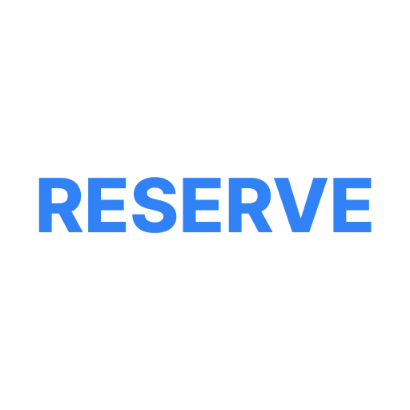
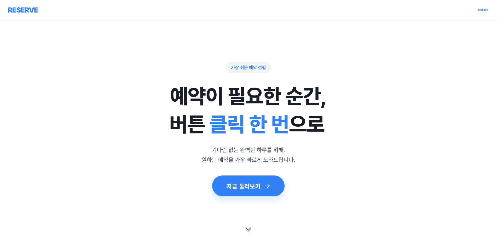
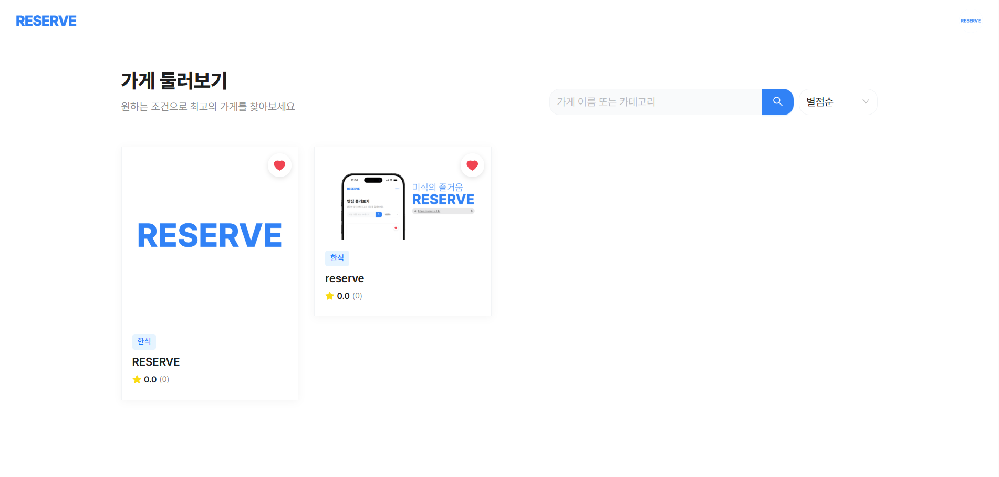
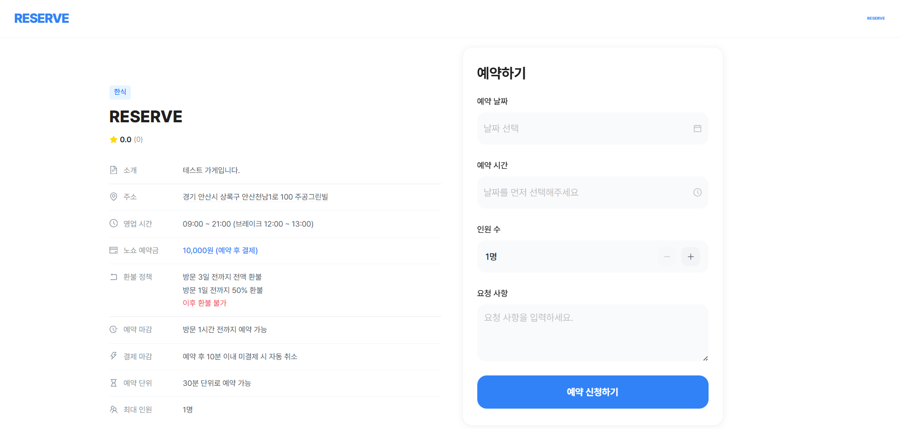
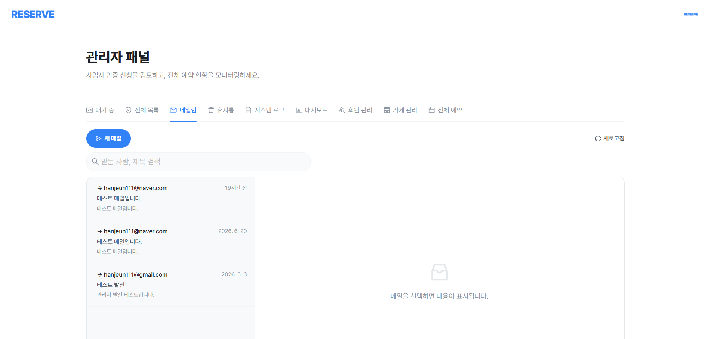
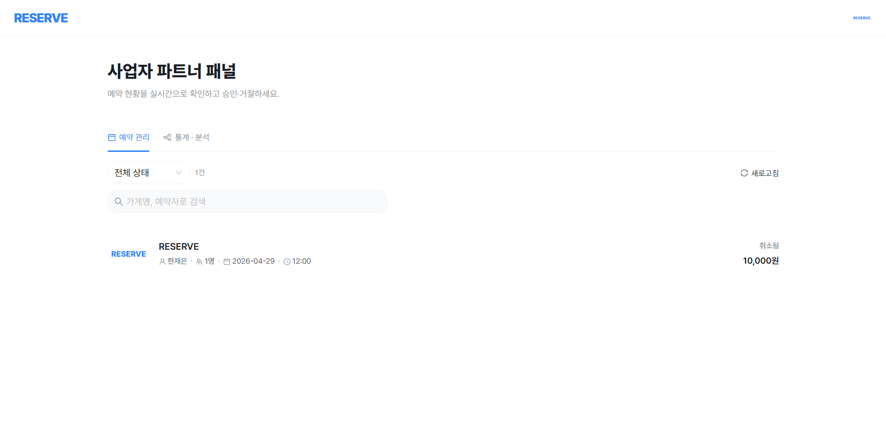
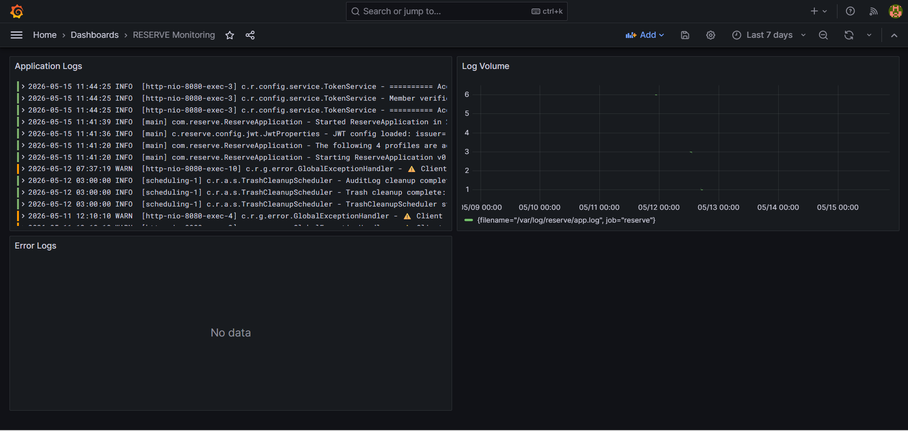

# RESERVE

<div align="center">



**예약이 필요한 순간** — 어떤 가게든, 찾고 예약하고 결제까지 한번에

🌐 **[reserve.it.kr](https://reserve.it.kr)**


</div>

---

## 소개

RESERVE는 업종에 구애받지 않고, 예약이 필요한 순간 누구나 가장 빠르게 예약할 수 있도록 도와주는 플랫폼입니다.

손님은 원하는 가게를 검색하고 간편하게 예약할 수 있으며, 사장님은 예약 관리와 승인/거절을 한 곳에서 처리할 수 있습니다. 노쇼 방지를 위한 예약금 결제 기능도 제공합니다.

---

## 스크린샷

| 홈 | 가게 목록 |
|---|---|
|  |  |

| 가게 상세 · 예약 | 관리자 패널 |
|---|---|
|  |  |

| 사업자 패널 | 모니터링 |
|---|---|
|  |  |

---

## 주요 기능

### 손님
- 가게 검색 · 정렬 · 즐겨찾기
- 날짜 · 시간 · 인원 선택 후 예약
- 노쇼 예약금 카카오페이 결제
- 예약 내역 조회 · 취소
- 리뷰 작성 · 수정 · 삭제
- Google / Naver / Kakao 소셜 로그인

### 사장님 (파트너)
- 가게 등록 · 수정 · 삭제
- 예약 승인 / 거절 / 완료 / 노쇼 처리
- 자동 승인 · 예약금 · 환불 정책 설정
- 예약 알림 이메일 수신 설정

### 관리자
- 사업자 인증 심사 (승인 / 거절)
- 전체 회원 · 예약 · 메일함 조회
- 소프트 삭제 · 휴지통 복구
- 시스템 로그 (감사 기록) 조회
- 통계 대시보드 (가게 등록 추이, 예약 현황)

---

## 기술 스택

| 영역 | 기술 |
|---|---|
| **Backend** | Spring Boot 3.5.6, Java 21, Spring Security, JWT, OAuth2 |
| **Frontend** | React 19, Vite, Ant Design 6, React Query 5, Zustand, Recharts |
| **Database** | MySQL 8.0 |
| **인프라** | AWS Lightsail, Docker, Nginx, GitHub Actions |
| **배포 방식** | Blue/Green 무중단 배포, 헬스체크 자동 롤백 |
| **스토리지** | AWS S3 + CloudFront CDN |
| **이메일** | Resend, ImprovMX |
| **결제** | 포트원 V2 (카카오페이) |
| **소셜 로그인** | Google, Naver, Kakao OAuth2 |
| **모니터링** | Grafana, Loki, Promtail, Sentry, UptimeRobot |
| **코드 품질** | SonarCloud, ESLint |

---

## 아키텍처


**배포 흐름** — main 브랜치에 push되면 GitHub Actions가 자동으로 실행됩니다

```
build-backend  → Gradle 빌드 → Docker 이미지 → DockerHub push
build-frontend → npm build → SCP → Nginx 정적 파일 교체
deploy-backend → Blue/Green 전환 → 헬스체크 → Nginx upstream 교체 → 구 컨테이너 종료
                                    └─ 실패 시 자동 롤백
```

---

## 문서

| 문서 | 내용 |
|---|---|
| [손님 가이드](docs/guide/user-guide.md) | 회원가입부터 예약·결제까지 |
| [사장님 가이드](docs/guide/owner-guide.md) | 가게 등록부터 예약 관리까지 |
| [아키텍처](docs/technical/architecture.md) | 인프라 구조 · 배포 방식 · Git 브랜치 전략 |
| [모니터링](docs/technical/monitoring.md) | Grafana · Loki · Sentry · UptimeRobot · SonarCloud |
| [코드 구조](docs/technical/structure.md) | 폴더 구조 · 라우트 · 환경변수 |
| [디자인 시스템](docs/technical/design-system.md) | 디자인 토큰 · 공통 컴포넌트 |
| [코드 컨벤션](docs/rules/code-conventions.md) | 네이밍 규칙 · 패키지 구조 |
| [Git 워크플로우](docs/rules/git-workflow.md) | 브랜치 전략 · PR 방법 · 커밋 메시지 |

---
