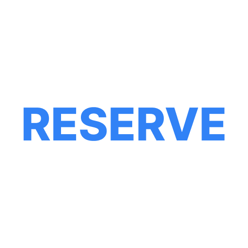
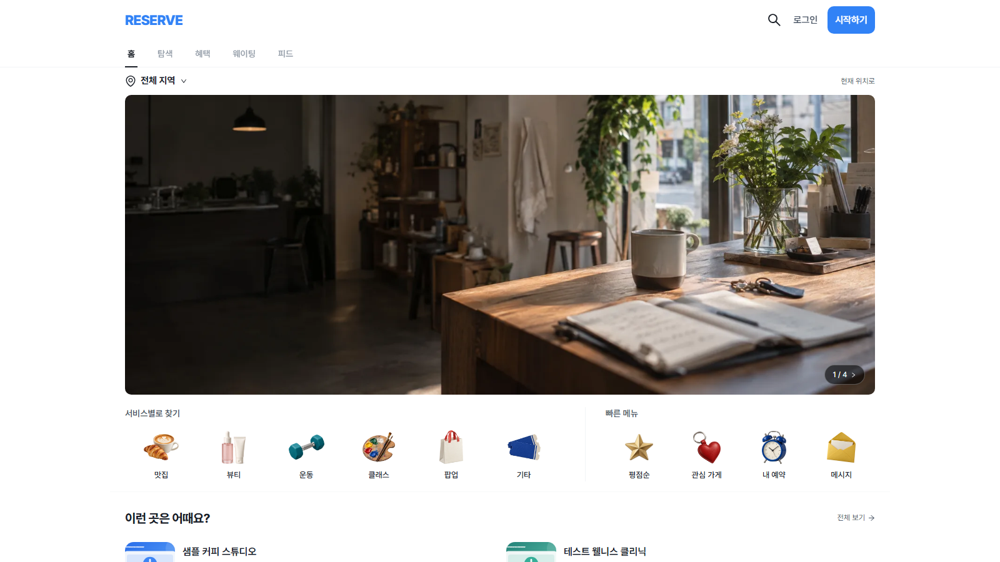
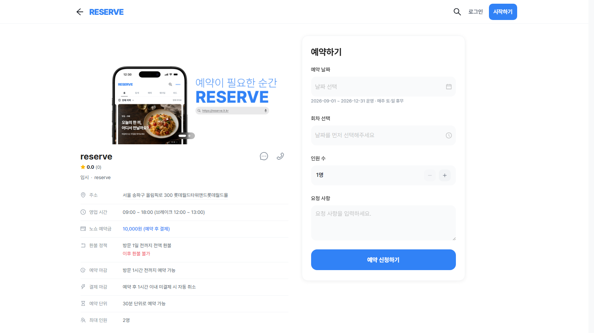
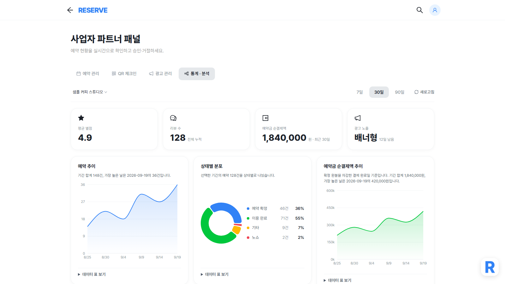
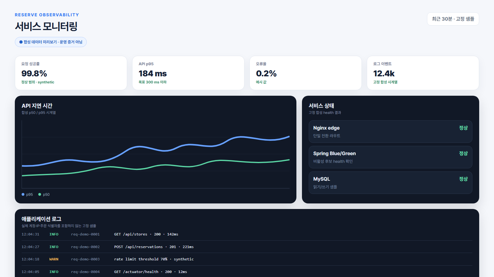
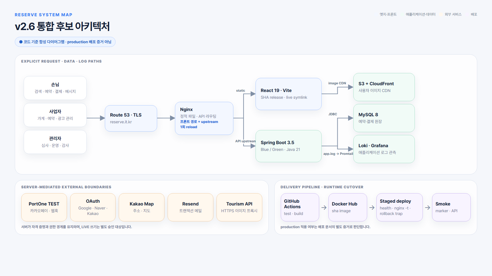

# RESERVE

<div align="center">



**예약이 필요한 순간** — 어떤 가게든, 찾고 예약하고 결제까지 한번에

🌐 **[reserve.it.kr](https://reserve.it.kr)**


</div>

---

## 소개

RESERVE는 업종에 구애받지 않고, 예약이 필요한 순간 누구나 가장 빠르게 예약할 수 있도록 도와주는 플랫폼입니다.

손님은 원하는 가게를 검색하고 간편하게 예약할 수 있으며, 사장님은 예약 관리와 승인/거절, 가게 홍보(광고)를 한 곳에서 처리할 수 있습니다. 노쇼 방지를 위한 예약금 결제와 방문 확인용 QR 체크인 기능도 제공합니다.

## 제공 상태

| 구분 | 상태 |
|---|---|
| 운영 | **v2.6.3** — 2026-09-27 확인한 배포 기준선 |
| 다음 릴리스 후보 | **v2.7.0** — 홈·탐색 UI, 메시징·사진, 광고 작성/미리보기 통합; 아직 미배포 |
| 로컬 프리뷰 | 운영 인증·캐시 수정과 아직 미배포인 기능을 `local-preview-all-changes`에서 대조·안정화 중 |
| 아직 아님 | 혼합 프리뷰의 일괄 `dev` 병합·배포, 통합 메시지 사진의 외부 서비스 실증 |

아래 기능 설명에는 운영 기능과 로컬 프리뷰 후보가 함께 있으므로, 구현되었다는 표현을 곧바로
운영 제공으로 읽지 않는다. 기능별 `코드 존재 / 로컬 검증 / dev 병합 / production 배포 / 외부 실증`은
[현재 상태](docs/technical/current-status.md)를 정본으로 확인한다.

---

## 스크린샷

아래 이미지는 2026-09-23 로컬 v2.6 후보의 실제 React 화면을 고정 합성 API 데이터로 렌더링한
미리보기다. 실제 계정·자격 증명·고객 데이터는 사용하지 않았으며 **production 배포 증거가 아니다**.
재생성 절차와 파일 해시는 [`generate-readme-assets.mjs`](frontend/scripts/generate-readme-assets.mjs)와
[`manifest.json`](docs/images/readme-v2.6/manifest.json)에 고정했다.

| 홈 | 가게 목록 |
|---|---|
|  |  |

| 가게 상세 · 예약 | 사업자 패널 |
|---|---|
|  |  |

| 관리자 패널 | 모니터링 미리보기 |
|---|---|
|  |  |

---

## 주요 기능

예약·결제·가게 관리·광고·QR 출석 기록은 운영 기준선에 포함된다. 아래의 통합 메시지, 독립 검색,
공개 가게 소식, 운영 안내·콘텐츠 출처, 지역 사진은 **로컬 v2.6 후보**이며 아직 운영 제공으로 표시하지 않는다.

### 손님
- 가게 검색 · 정렬 · 즐겨찾기, 가까운 가게 **우리동네 배지**(위치 기반)
- 날짜 · 시간 · 인원 선택 후 예약, 예약 **수정**
- 노쇼 예약금 카카오페이 결제
- 승인된 예약 방문 시 **QR 체크인**(예약 상태는 바꾸지 않고 출석 시각 기록)
- 예약 내역 조회 · 취소
- 리뷰 작성 · 수정 · 삭제
- 고객지원과 가게 문의를 한곳에서 보는 통합 메시지
- Google / Naver / Kakao 소셜 로그인

### 사장님 (파트너)
- 가게 등록 · 수정 · 삭제
- 예약 승인 / 거절 / 완료 / 노쇼 처리, **QR 스캔 출석 기록**
- 자동 승인 · 예약금 · 환불 정책 설정
- **광고 등록 · 결제**(카드·리스트 상단 노출형 · 가게 목록 플로팅 배너형, 포트원 결제)
- 예약/매출 **통계** 조회
- 예약 알림 이메일 수신 설정
- 소유 가게의 고객 문의 받은편지함 · 답장

### 관리자
- 사업자 인증 심사 (승인 / 거절)
- 전체 회원 · 예약 · 광고 · 메일함 조회
- 소프트 삭제 · 휴지통 복구
- 시스템 로그 (감사 기록) 조회
- 통계 대시보드 (가게 등록 추이, 예약 현황)

---

## 기술 스택

| 영역 | 기술 |
|---|---|
| **Backend** | Spring Boot 3.5.6, Java 21, Spring Security, JWT, OAuth2 |
| **Frontend** | React 19, Vite, Ant Design 6, TanStack Query 5, Zustand, Recharts |
| **Database** | MySQL 8.0 |
| **인프라** | AWS Lightsail, Docker, Nginx, GitHub Actions |
| **배포 방식** | Blue/Green 무중단 배포, 헬스체크 자동 롤백 |
| **스토리지** | AWS S3 + CloudFront CDN |
| **이메일** | Resend |
| **결제** | 포트원 V2 (카카오페이) |
| **소셜 로그인** | Google, Naver, Kakao OAuth2 |
| **성능 · 보안** | 라우트 코드 분할, Bucket4j Rate Limiting, 비관적 락 동시성 제어 |
| **모니터링** | Grafana, Loki, Promtail, Sentry, UptimeRobot |
| **코드 품질** | SonarCloud, ESLint |

---

## 아키텍처



위 그림은 현재 로컬 코드의 경계를 정리한 합성 다이어그램이며 production 적용 증거가 아니다.
정확한 배포 상태는 아래 흐름과 [배포 운영 문서](docs/technical/deployments.md)를 우선한다.

**배포 흐름** — 승인된 release PR이 `main`에 반영되면 GitHub Actions가 실행됩니다. 아래 v2.6
후보 흐름은 현재 로컬 워크플로에 있으며 아직 production에서 실증되지 않았습니다.

```
build-backend  → Gradle 빌드 → Docker 이미지 → DockerHub push
build-frontend → 단위·브라우저 테스트 → npm build → SHA별 프론트 디렉터리에 staging
deploy-backend → 비활성 Blue/Green 기동 → health 확인
               → 새 프론트 절대 경로 + 새 upstream을 한 번의 Nginx reload로 전환
               → Nginx 경유 smoke 후 구 컨테이너 종료
               └─ 실패 시 프론트 경로·Nginx 설정·upstream 함께 롤백
```

---

## 문서

| 문서 | 내용 |
|---|---|
| [손님 가이드](docs/guide/user-guide.md) | 회원가입부터 예약·결제까지 |
| [사장님 가이드](docs/guide/owner-guide.md) | 가게 등록부터 예약 관리까지 |
| [아키텍처](docs/technical/architecture.md) | 인프라 구조 · 배포 방식 · Git 브랜치 전략 |
| [모니터링](docs/technical/monitoring.md) | Grafana · Loki · Sentry · UptimeRobot · SonarCloud |
| [백업 · 복구](docs/technical/backup.md) | MySQL 백업 구성 · 복원 절차 · 복원 훈련 |
| [결제 · 환불](docs/technical/payments.md) | PortOne 웹훅 · 환불 원장 · 미결 대사 절차 |
| [데이터 생명주기](docs/technical/data-lifecycle.md) | 회원 탈퇴 · 가게 영업 종료 · 파일 삭제 outbox · 보존 정책 |
| [계정 보안](docs/technical/account-security.md) | 비밀번호 정책 · 전체 세션 무효화 · 동의 이력 · OAuth unlink outbox |
| [가게 임시저장](docs/technical/store-drafts.md) | IndexedDB 자동저장 · 복원 UX · 비용·한계 |
| [통합 메시지](docs/technical/messaging.md) | 고객지원·가게 문의 권한 · 전송 안정성 · 확장 관문 |
| [API 버전 관리](docs/technical/api-versioning.md) | v1 전환 판단 기준 · 호환성 · 단계적 폐기 원칙 |
| [지역 사진 자산](docs/technical/region-photo-assets.md) | 공공누리 사진의 등록 기준 · 출처 · 가공 범위 |
| [현재 상태](docs/technical/current-status.md) | 코드·로컬·dev·production·외부 실증을 분리한 정본 |
| [배포 운영](docs/technical/deployments.md) | 릴리스 · 원자적 프론트 배포 · 배포 후 검증 |
| [코드 구조](docs/technical/structure.md) | 폴더 구조 · 라우트 · 환경변수 |
| [디자인 시스템](docs/technical/design-system.md) | 디자인 토큰 · 공통 컴포넌트 |
| [UI 구현 결정](docs/technical/ui-decisions.md) | 공통 UI의 선택 이유 · 회귀 경계 |
| [품질 로드맵](docs/technical/quality-roadmap.md) | 프리뷰 검증 결과 · 미해결 위험 · PR 정리 순서 |
| [기술 문서 안내](docs/technical/README.md) | 현재 계약·계획·과거 작업 기록을 구분하는 색인 |
| [코드 컨벤션](docs/rules/code-conventions.md) | 네이밍 규칙 · 패키지 구조 |
| [Git 워크플로우](docs/rules/git-workflow.md) | 브랜치 전략 · PR 방법 · 커밋 메시지 |
