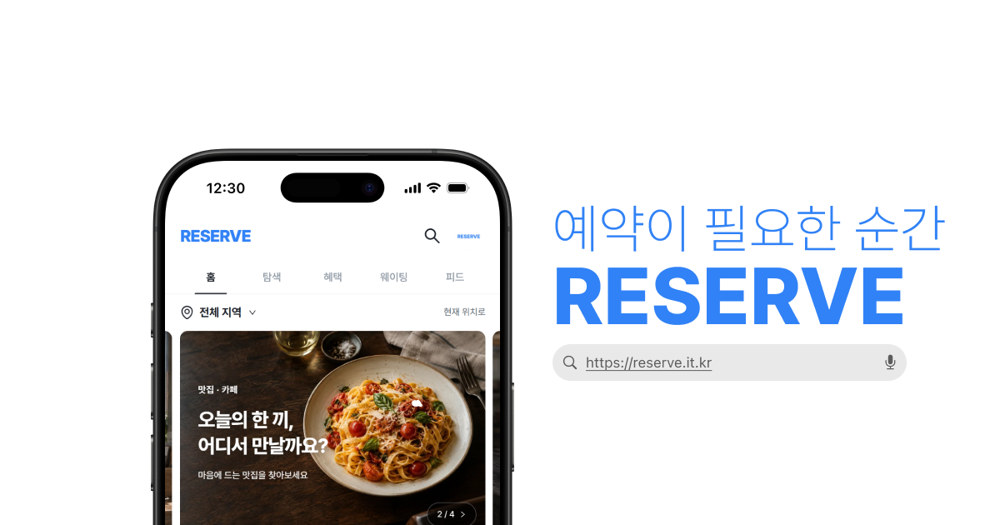
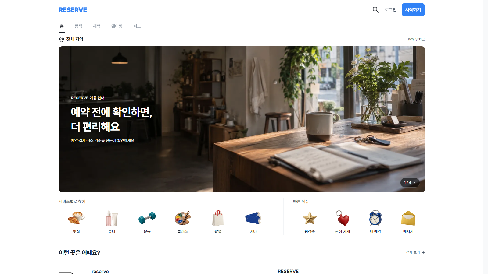
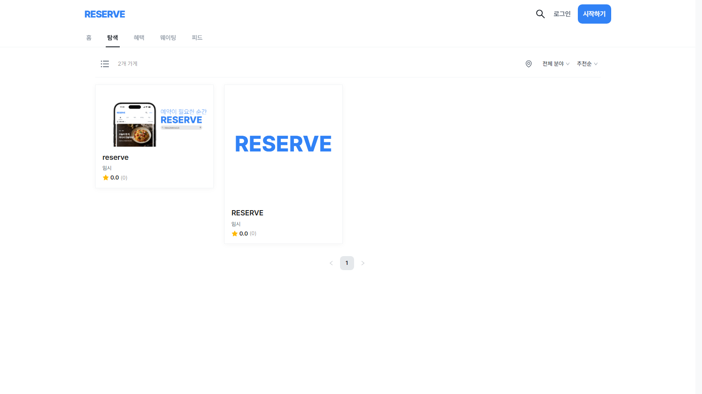
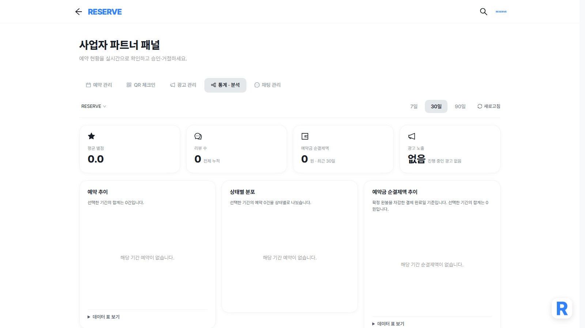
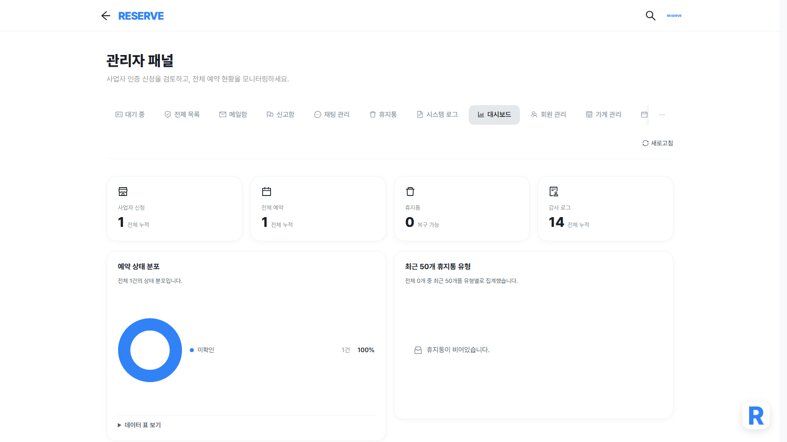
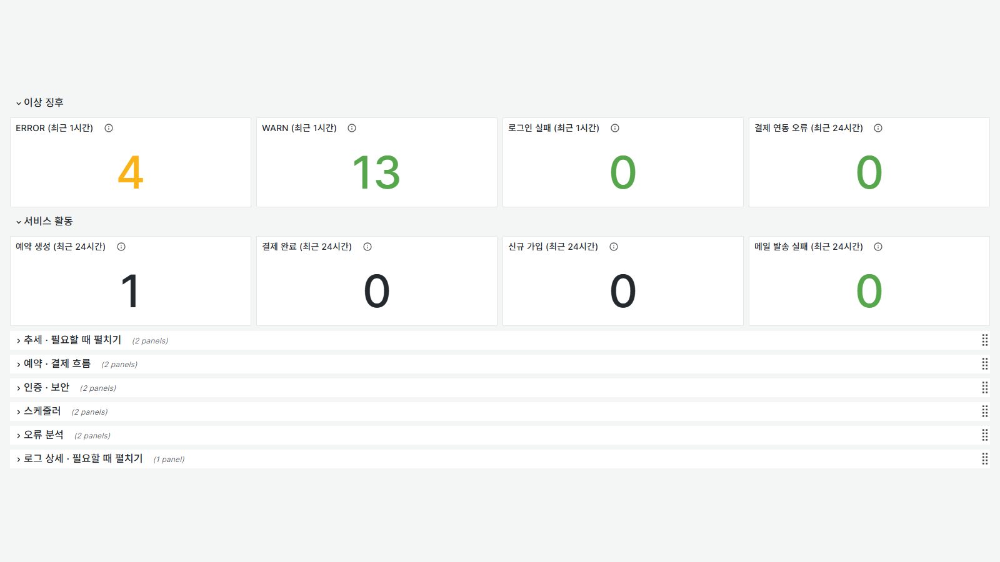
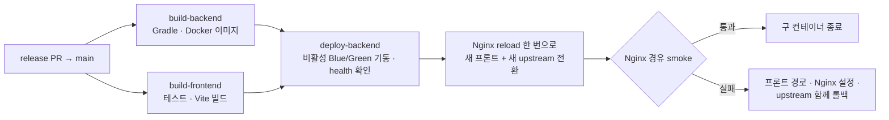

<picture>
  <source media="(prefers-color-scheme: dark)" srcset="docs/images/title-dark.svg" />
  
</picture>

[**서비스 바로가기**](https://reserve.it.kr) &nbsp;·&nbsp;
[손님 가이드](docs/guide/user-guide.md) &nbsp;·&nbsp;
[사장님 가이드](docs/guide/owner-guide.md) &nbsp;·&nbsp;
[업데이트 소식](docs/CHANGELOG.md) &nbsp;·&nbsp;
[기술 문서](docs/technical/README.md)

 

 

## 소개

RESERVE는 맛집·카페, 뷰티, 운동, 클래스, 팝업까지 업종을 가리지 않고 쓰는 예약 플랫폼이에요.
시간대 · 회차 · 날짜 단위 세 가지 예약 방식을 지원하고, 빈자리 확인부터 노쇼 예약금 결제, QR 방문 확인, 가게 문의 채팅까지 예약에 필요한 흐름을 한곳에서 처리해요.

## 화면

아래 화면은 운영 사이트([reserve.it.kr](https://reserve.it.kr))를 그대로 찍은 것이에요.

| 홈 | 가게 목록 |
|---|---|
|  |  |

| 가게 상세 | 사업자 패널 |
|---|---|
|  |  |

| 관리자 패널 | 모니터링 |
|---|---|
|  |  |

## 주요 기능

### 🙋 손님

- 가게 검색 · 정렬 · 즐겨찾기, 서비스 분야별 찾기와 가까운 가게 **우리동네 배지**
- 시간대 · 회차 · 날짜 단위의 세 가지 예약 방식, 빈자리와 마감을 보여 주는 **예약 달력**
- 노쇼 예약금 **카카오페이 결제**, 환불 정책에 따른 취소·환불
- 승인된 예약 방문 시 **QR 체크인**
- 리뷰 작성 · 수정 · 삭제
- 고객지원과 가게 문의를 한곳에서 보는 **통합 메시지**(차단 · 신고 · 숨김)
- Google / Naver / Kakao 소셜 로그인

### 🏪 사장님

- 가게 등록 · 수정 · 삭제, 운영 기간 · 영업시간 · 브레이크 타임 · 휴무일 설정
- 예약 승인 / 거절 / 완료 / 노쇼 처리, **QR 스캔 출석 기록**
- 자동 승인 · 예약금 · 환불 정책 · 동시간대 정원 · 중복 예약 허용 설정
- **광고 등록 · 결제** — 카드·리스트 상단 노출형, 가게 목록 배너형(제목·내용 직접 작성, 미리보기)
- 예약 · 리뷰 · 예약금 **통계**
- 예약 알림 이메일, 가게 문의 받은편지함 · 답장

### 🛡️ 관리자

- 사업자 인증 심사 (승인 / 거절)
- 전체 회원 · 가게 · 예약 · 광고 · 메일함 조회
- 소프트 삭제 · 휴지통 복구
- 시스템 로그(감사 기록) 조회, 통계 대시보드

## 기술 스택

| 영역 | 기술 |
|---|---|
| **Backend** | Spring Boot 3.5.6 · Java 21 · Spring Security · JWT · OAuth2 |
| **Frontend** | React 19 · Vite · Ant Design 6 · TanStack Query 5 · Zustand · Recharts |
| **Database** | MySQL 8.0 |
| **Infra** | AWS Lightsail · Docker · Nginx · GitHub Actions · S3 + CloudFront |
| **결제 · 메일** | 포트원 V2 (카카오페이) · Resend |
| **모니터링** | Grafana · Loki · Promtail · Sentry · UptimeRobot |
| **품질** | JUnit · Vitest · Playwright · ESLint · SonarCloud |

## 아키텍처

  

```mermaid
flowchart LR
    PR["release PR → main"] --> BE["build-backend<br/>Gradle · Docker 이미지"]
    PR --> FE["build-frontend<br/>테스트 · Vite 빌드"]
    BE --> DEPLOY["deploy-backend<br/>비활성 Blue/Green 기동 · health 확인"]
    FE --> DEPLOY
    DEPLOY --> SWITCH["Nginx reload 한 번으로<br/>새 프론트 + 새 upstream 전환"]
    SWITCH --> SMOKE{"Nginx 경유 smoke"}
    SMOKE -- 통과 --> DONE["구 컨테이너 종료"]
    SMOKE -- 실패 --> ROLLBACK["프론트 경로 · Nginx 설정 ·<br/>upstream 함께 롤백"]
```

## 문서

| 분류 | 문서 |
|---|---|
| **사용 안내** | [손님 가이드](docs/guide/user-guide.md) · [사장님 가이드](docs/guide/owner-guide.md) · [업데이트 소식](docs/CHANGELOG.md) |
| **구조** | [아키텍처](docs/technical/architecture.md) · [코드 구조](docs/technical/structure.md) · [디자인 시스템](docs/technical/design-system.md) · [UI 구현 결정](docs/technical/ui-decisions.md) |
| **운영** | [배포 운영](docs/technical/deployments.md) · [모니터링](docs/technical/monitoring.md) · [백업 · 복구](docs/technical/backup.md) |
| **도메인** | [결제 · 환불](docs/technical/payments.md) · [통합 메시지](docs/technical/messaging.md) · [가게 임시저장](docs/technical/store-drafts.md) · [데이터 생명주기](docs/technical/data-lifecycle.md) |
| **보안 · API** | [계정 보안](docs/technical/account-security.md) · [API 버전 관리](docs/technical/api-versioning.md) · [보안 정책](SECURITY.md) |
| **자산 · 규칙** | [지역 사진 자산](docs/technical/region-photo-assets.md) · [서드파티 고지](THIRD_PARTY_NOTICES.md) · [코드 컨벤션](docs/rules/code-conventions.md) · [Git 워크플로우](docs/rules/git-workflow.md) |
| **전체 색인** | [기술 문서 안내](docs/technical/README.md) · [품질 로드맵](docs/technical/quality-roadmap.md) |
