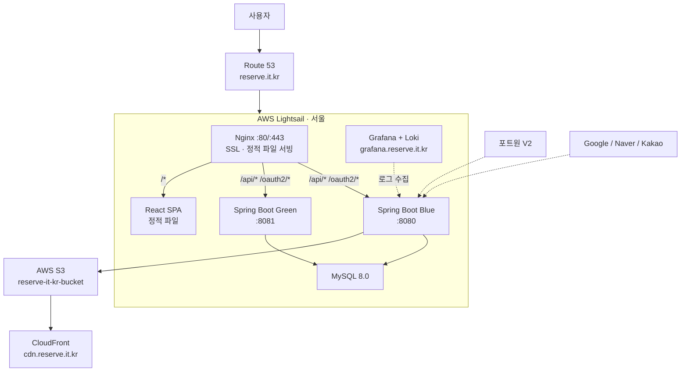

# 아키텍처

---

## 인프라 구성




---

## AWS 서비스 구성

| 서비스 | 용도 | 세부 |
|---|---|---|
| **Lightsail** | 애플리케이션 서버 | $10/월, 2GB RAM, 서울(ap-northeast-2) |
| **Route 53** | DNS 호스팅 | reserve.it.kr 호스팅 영역 |
| **S3** | 이미지 스토리지 | reserve-it-kr-bucket, 서울 |
| **CloudFront** | 이미지 CDN | cdn.reserve.it.kr (E1VOAW2W8K0VA4) |
| **ACM** | SSL 인증서 | CloudFront용, us-east-1 리전 필수 |
| **IAM** | S3 접근 제어 | reserve-s3-user (AmazonS3FullAccess) |

---

## S3 폴더 구조

```
reserve-it-kr-bucket/
├── profiles/          ← 프로필 이미지
├── stores/
│   ├── thumbnails/    ← 가게 대표 이미지
│   └── images/        ← 가게 상세 이미지
└── businesses/        ← 사업자 인증 서류
```

---

## Docker 컨테이너 구성

```
app-network (bridge)
  ├── nginxserver  → 80, 443
  ├── blue         → 8080:8080 (또는 비활성)
  ├── green        → 8081:8080 (또는 비활성)
  └── mysql        → 127.0.0.1:3306:3306
```

### Nginx 마운트
```
/home/ubuntu/nginx          → /etc/nginx/conf.d
/usr/share/nginx/html       → /usr/share/nginx/html (React SPA)
/etc/letsencrypt            → /etc/letsencrypt:ro (SSL 인증서)
```

---

## Blue/Green 배포 흐름

```
1. main 브랜치 push

2. GitHub Actions 시작
   ├── build-backend
   │     └── Gradle 빌드 → Docker 이미지 → DockerHub push
   ├── build-frontend (needs: build-backend)
   │     └── npm build → SCP로 서버 전송 → PRIVATE_IP 자동 치환 → Nginx 정적 파일 갱신
   └── deploy-backend (needs: build-backend)
         ├── 현재 활성 컨테이너 확인 (Blue or Green)
         ├── 반대 컨테이너 새로 기동
         ├── SSH 내부 헬스체크 (localhost:port/actuator/health)
         ├── Nginx upstream 전환 (service-env.inc 수정 후 reload)
         └── 구 컨테이너 종료
```

---

## Git 브랜치 전략

```
main          ← 배포 브랜치 (CI/CD 트리거)
  ↑
dev           ← 개발 통합 브랜치 (기본 브랜치)
  ↑
feature/*     ← 기능별 작업
```

- `feature/*` 완료 → `dev` PR 머지 (배포 없음)
- `dev` 안정화 → `main` PR 머지 → CI/CD 자동 실행
- 긴급 수정: `hotfix/*` → `main` 직접 PR

---

## SSL 인증서

- **방식**: Let's Encrypt (Certbot)
- **위치**: `/etc/letsencrypt/live/reserve.it.kr/`
- **자동갱신**: certbot.timer (systemd, 하루 2번 체크)
- **Nginx reload 훅**: `/etc/letsencrypt/renewal-hooks/deploy/reload-nginx.sh`

---

## 외부 서비스

| 서비스 | 용도 |
|---|---|
| **DockerHub** | Docker 이미지 저장소 (hanjeun/reserve) |
| **GitHub Actions** | CI/CD 파이프라인 |
| **Resend** | 이메일 발송 (reserve@reserve.it.kr) |
| **Portone V2** | 카카오페이 결제 |
| **Google/Naver/Kakao** | OAuth2 소셜 로그인 |
